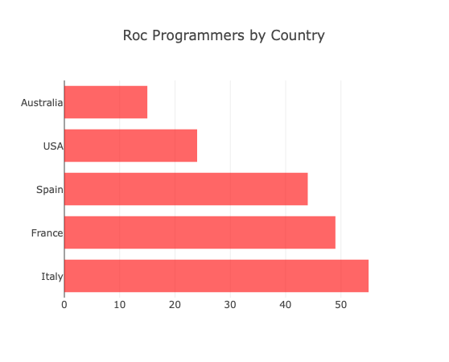

# Plume

A [roc](https://www.roc-lang.org) package for creating beautiful data-driven visualizations powered by [plotly.js](https://github.com/plotly/plotly.js)

## Status

Early development / Proof of Concept -- usable, and easy to extend... let me know if you would like to contribute. I made this to build some simple graphs for my routine budgeting process... and wanted to use roc and explore the API.

## Usage

```sh
$ roc simple.roc
```

### Screenshot


### `simple.roc`

```roc
app [main!] {
    cli: platform "https://github.com/roc-lang/basic-cli/releases/download/0.18.0/0APbwVN1_p1mJ96tXjaoiUCr8NBGamr8G8Ac_DrXR-o.tar.br",
    plume: "<<<REPLACE WITH RELEACE URL>>>",
}

import cli.File
import cli.Cmd
import plume.Chart
import plume.Scatter
import plume.Marker
import plume.Line
import plume.Layout
import plume.Font
import plume.Title
import plume.Axis
import plume.Color exposing [rgba]

main! = \_ ->

    title_font = Font.new? {
        family: "Ringbearer",
        size: 24,
        style: Italic,
    }

    axis_font = Font.new? {
        family: "Courier New, monospace",
        size: 18,
    }

    data : List { x : Str, y : F64 }
    data = [
        { x: "Apples", y: 2.1 },
        { x: "Oranges", y: 3 },
        { x: "Bananas", y: 4 },
    ]

    scatter : Scatter.Trace Str F64
    scatter =
        Scatter.new? {
            data,
            mode: "lines+markers",
            marker: [
                Marker.size 15.0,
                Marker.symbol? "diamond",
                Marker.color (rgba 124 56 245 255),
            ],
            line: [
                Line.width 2.0,
                Line.color (rgba 124 56 245 150),
                Line.dash? "dash",
            ],
        }

    chart =
        Chart.empty
        |> Chart.add_scatter_chart scatter
        |> Chart.with_layout
            (
                Layout.new {
                    title: Title.new { text: "Fruit Sales", font: title_font },
                    y_axis: Axis.new { title: Title.new { text: "Qty", font: axis_font } },
                }
            )

    File.write_utf8!? (Chart.to_html chart) "out.html"

    Cmd.exec! "open" ["out.html"]

```

## Examples

### Bar

[Source Code](examples/bar-chart.roc)


### Bubble

[Source Code](examples/bubble.roc)


### Donut

[Source Code](examples/donut.roc)


### Equation Cosine

[Source Code](examples/equation-cosine.roc)


### Equation Sine

[Source Code](examples/equation-sine.roc)


### Horizontal Bar

[Source Code](examples/horizontal-bar-chart.roc)



### Line

[Source Code](examples/line.roc)


### Pie

[Source Code](examples/pie.roc)


### Sankey

[Source Code](examples/sankey.roc)


